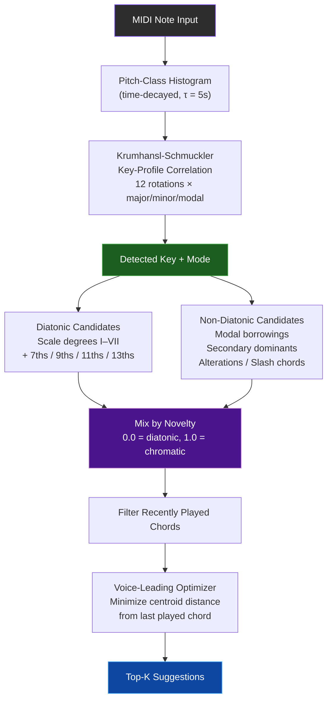

# Chord Suggestion Pipeline

```mermaid
flowchart TD
    A["MIDI Note Input"] --> B["Pitch-Class Histogram<br>(time-decayed, τ = 5s)"]

    B --> C["Krumhansl-Schmuckler<br>Key-Profile Correlation<br>12 rotations × major/minor/modal"]

    C --> D["Detected Key + Mode"]

    D --> E["Diatonic Candidates<br>Scale degrees I–VII<br>+ 7ths / 9ths / 11ths / 13ths"]
    D --> F["Non-Diatonic Candidates<br>Modal borrowings<br>Secondary dominants<br>Alterations / Slash chords"]

    E --> G["Mix by Novelty<br>0.0 = diatonic, 1.0 = chromatic"]
    F --> G

    G --> H["Filter Recently Played Chords"]

    H --> I["Voice-Leading Optimizer<br>Minimize centroid distance<br>from last played chord"]

    I --> J["Top-K Suggestions"]

    style A fill:#2d2d2d,stroke:#7c4dff,color:#fff
    style D fill:#1b5e20,stroke:#4caf50,color:#fff
    style G fill:#4a148c,stroke:#ce93d8,color:#fff
    style J fill:#0d47a1,stroke:#42a5f5,color:#fff
```
