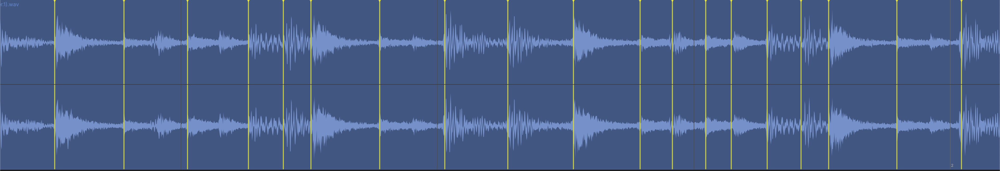

# Clips

Clips are the containers that hold audio and MIDI data on tracks. They appear as rectangular blocks in the Arrangement View timeline and as trigger pads in Session View.

## Clip Types

| Type | Description |
|------|-------------|
| **Audio** | Contains a reference to an audio file (WAV, AIFF, FLAC, MP3, OGG) with start/end points and gain |
| **MIDI** | Contains MIDI note and automation data |

Because MAGDA uses a [hybrid track system](tracks.md#hybrid-track-system), any track can hold both audio and MIDI clips.

## MIDI Clip Properties

| Property | Description |
|----------|-------------|
| **Name** | Display name of the clip |
| **Colour** | Clip colour in the editor |
| **Start** | Start position in beats |
| **Length** | Duration in beats |
| **Offset** | Non-destructive trim offset in beats |
| **Transpose** | Pitch shift from -24 to +24 semitones |

## Audio Clip Properties

| Property | Description |
|----------|-------------|
| **Name** | Display name of the clip |
| **Colour** | Clip colour in the editor |
| **Start** | Start position on the timeline |
| **Length** | Duration |
| **Offset** | Start position in the source file for non-destructive trimming |
| **Speed Ratio** | Playback speed factor (0.25x to 4.0x) |
| **Loop** | Enable looping with configurable loop start and length |
| **Warp** | Enable warp markers for per-segment time-stretching |
| **Auto Tempo** | Lock clip to project tempo (beat mode) |
| **Source BPM** | Original tempo of the source file |
| **Transpose** | Manual pitch shift from -24 to +24 semitones |
| **Auto-Pitch** | Automatic pitch tracking (Pitch Track, Chord Mono, Chord Poly) |
| **Analog Pitch** | Resample instead of time-stretch for pitch changes |
| **Volume** | Clip volume in dB |
| **Gain** | Additional boost from 0 to +24 dB |
| **Pan** | Stereo position from L to R |
| **Reverse** | Play audio backwards |
| **Fade In / Out** | Fade duration and curve type (Linear, Convex, Concave, S-Curve) |
| **Auto Crossfade** | Automatic crossfade with adjacent clips |

## Session Clip Properties

Both MIDI and audio clips in Session View have additional launch properties:

| Property | Description |
|----------|-------------|
| **Launch Mode** | Trigger (one-shot) or Toggle (on/off) |
| **Launch Quantize** | Quantize launch timing (None, 8 Bars, 4 Bars, 2 Bars, 1 Bar, 1/2, 1/4, 1/8, 1/16) |

!!! note
    Session clips do not have an absolute position property — they are not placed on the timeline. Their position is determined by the scene slot they occupy.

## Creating Clips

- **Double-click** an empty area on a track to create a new 1-bar MIDI clip at that position
- **Double-click** over a time selection to create a MIDI clip matching the selection length

## Selecting Clips

- **Click** a clip to select it
- **Shift+click** to add or remove clips from the selection
- ++cmd+a++ (++ctrl+a++ on Windows/Linux) selects all clips in the arrangement, or all notes when a MIDI editor is focused

## Editing Clips

- **Move** — Drag a clip to reposition it on the timeline or move it to another track
- **Resize** — Drag the left or right edge of a clip to trim its start or end point
- **Duplicate** — Hold ++alt++ and drag a clip, or press ++cmd+d++
- **Split** — Position the playhead and use **Edit > Split Clip** or press ++cmd+e++
- **Delete** — Select the clip and press ++delete++ or ++backspace++

## Cut, Copy, and Paste

- ++cmd+x++ — Cut the selected clip(s)
- ++cmd+c++ — Copy the selected clip(s)
- ++cmd+v++ — Paste at the playhead position on the same track

## Audio Clip Modes

Audio clips have several playback modes that control how the clip responds to tempo changes and pitch adjustments. Set the mode in the clip's Inspector panel.

### Raw (Default)

The clip plays back at its original speed and pitch, unaffected by the project tempo. Changing the project tempo does not stretch or compress the clip. This is the simplest mode — what you recorded or imported is what you hear.

### Beat Mode

Locks the clip's length to a musical duration (e.g. 4 bars). When the project tempo changes, MAGDA time-stretches the audio so it always fills the same number of bars. Use this for loops, drum patterns, and rhythmic material that should stay in sync with the project.

### Repitch Mode

Adjusts playback speed to match tempo changes — like speeding up or slowing down a vinyl record. Faster tempo raises pitch, slower tempo lowers it. No time-stretching artefacts, but the pitch shifts with tempo. Useful for lo-fi effects or when pitch drift is acceptable.

### Warp Mode

Enables per-segment time-stretching using **warp markers**. Each marker pins a point in the audio to a specific position on the timeline. The audio between markers is independently stretched or compressed. This is the most flexible mode — use it to align a free-tempo recording to the grid, fix timing, or create creative effects.

- **Add a warp marker** — Double-click the waveform at the desired position
- **Move a warp marker** — Drag it left or right to shift that section of audio earlier or later
- **Delete a warp marker** — Double-click an existing marker, or right-click and select Remove

### Slicing

Right-click an audio clip to access slice operations. These split the clip into multiple pieces based on warp markers or the current grid setting.

- **Slice at Warp Markers In Place** — Split the clip at each warp marker position, creating separate clips on the same track. Requires warp mode with at least one user-placed marker.
- **Slice at Grid In Place** — Split the clip at every grid line, creating separate clips on the same track.
- **Slice at Warp Markers to Drum Grid** — Create a new Drum Grid track where each slice between warp markers becomes a pad, with a MIDI pattern that reproduces the original timing.
- **Slice at Grid to Drum Grid** — Same as above but slicing at grid intervals instead of warp markers.

### Time-Stretch Algorithm

When Beat or Warp mode is active, MAGDA uses the **SoundTouch** algorithm for time-stretching.

## Freeze, Bounce, and Render

These operations render a track or clip's output to audio, useful for reducing CPU load or committing effects.

- **Freeze** — Render the track's output to a temporary audio file to free up CPU. The track becomes read-only until unfrozen. Use **Track > Freeze Track**.
- **Bounce in Place** — Render the track to a new audio clip that replaces the original content. Use **Track > Bounce in Place**.
- **Bounce to New Track** — Render the track's output to a new audio track, preserving the original track unchanged. Use **Track > Bounce to New Track**.
