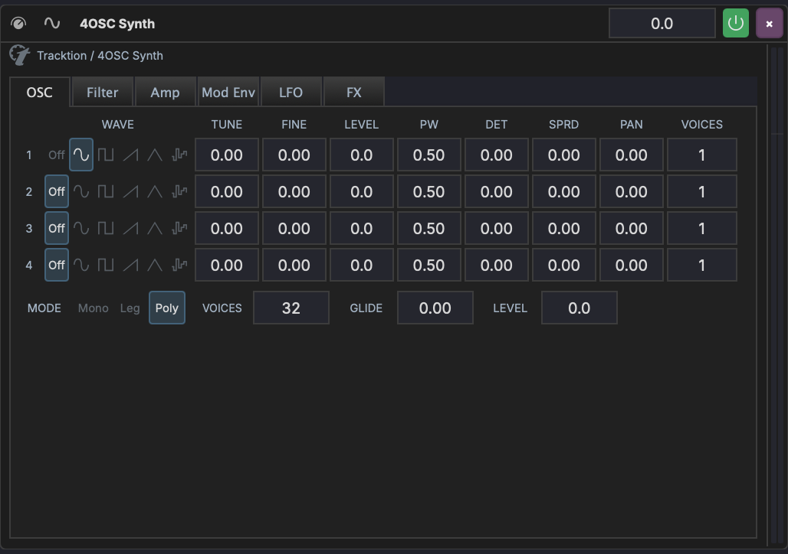
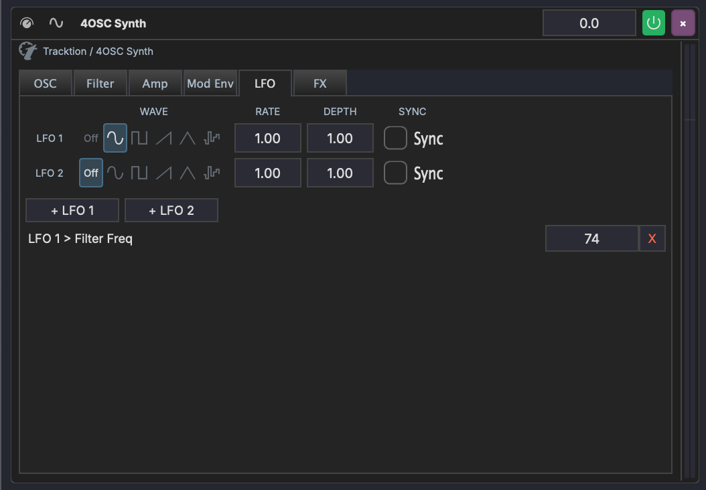

# 4OSC Synth

The 4OSC Synth is a four-oscillator subtractive synthesizer provided by the Tracktion Engine. It offers a full synthesis signal path with oscillators, filters, envelopes, LFOs, effects, and an internal modulation matrix.

## Overview

The 4OSC interface is organized into six tabs:

| Tab | Content |
|-----|---------|
| **OSC** | Four oscillators with wave shape, tuning, level, pulse width, detune, spread, pan, and unison voices |
| **Filter** | Multimode filter with cutoff, resonance, key tracking, velocity, and a dedicated filter envelope |
| **Amp** | Amplitude envelope (ADSR) with velocity sensitivity and analog mode |
| **Mod Env** | Two modulation envelopes with ADSR controls and mod destination assignments |
| **LFO** | Two LFOs with wave shape, rate, depth, tempo sync, and mod destination assignments |
| **FX** | Built-in distortion, reverb, delay, and chorus effects |

## OSC Tab

Each of the four oscillators has:

| Parameter | Description |
|-----------|-------------|
| **Wave Shape** | Sine, triangle, square, sawtooth, pulse, noise |
| **Tune** | Coarse tuning in semitones |
| **Fine** | Fine tuning in cents |
| **Level** | Oscillator volume in dB |
| **Pulse Width** | Pulse width for pulse/square waves |
| **Detune** | Unison detune amount |
| **Spread** | Stereo spread of unison voices |
| **Pan** | Stereo position |
| **Voices** | Number of unison voices |

Below the oscillators are global controls:

| Parameter | Description |
|-----------|-------------|
| **Mode** | Mono, Legato, or Poly voice mode |
| **Voices** | Maximum polyphony (poly mode) |
| **Legato** | Legato glide time |
| **Master Level** | Master output level in dB |

## Filter Tab

A multimode filter with its own envelope:

- **Type** — Low-pass, high-pass, band-pass, notch
- **Slope** — 12 dB or 24 dB per octave
- **Freq** — Cutoff frequency
- **Resonance** — Filter resonance
- **Key Track** — How much the cutoff follows the note pitch
- **Velocity** — How much velocity affects the cutoff
- **Amount** — Filter envelope depth

The filter envelope has independent Attack, Decay, Sustain, and Release controls.

## Amp Tab

The amplitude envelope shapes the volume of each note:

- **Attack, Decay, Sustain, Release** — Standard ADSR
- **Velocity** — How much velocity affects the volume
- **Analog** — Adds subtle per-voice variation for an analog feel

## Mod Env Tab

Two modulation envelopes (Env 1 and Env 2) that can be routed to any synth parameter via the internal mod matrix. Each has Attack, Decay, Sustain, and Release controls.

### Assigning Mod Envelope Destinations

Below the envelope controls, use the **+ Env 1** and **+ Env 2** buttons to assign a modulation destination:

1. Click **+ Env 1** (or **+ Env 2**)
2. Select the destination parameter from the dropdown
3. Click **Add**
4. Drag the depth slider to set the modulation amount (-100% to +100%)
5. Click **X** to remove an assignment

## LFO Tab

Two LFOs with independent controls:

| Parameter | Description |
|-----------|-------------|
| **Wave** | Sine, triangle, square, sawtooth, sample & hold, noise |
| **Rate** | LFO speed |
| **Depth** | LFO intensity |
| **Sync** | Lock rate to project tempo |

### Assigning LFO Destinations

Below the LFO controls, use the **+ LFO 1** and **+ LFO 2** buttons to assign modulation destinations. The workflow is the same as for mod envelopes:

1. Click **+ LFO 1** (or **+ LFO 2**)
2. Select the destination parameter from the dropdown
3. Click **Add**
4. Drag the depth slider to set the modulation amount (-100% to +100%)
5. Click **X** to remove an assignment

Each assignment appears as a row showing the source and destination (e.g. "LFO 1 > Filter Freq") with a depth slider.

## FX Tab

Built-in effects that can be toggled on or off independently:

| Effect | Parameters |
|--------|------------|
| **Distortion** | Amount |
| **Reverb** | Size, Damping, Width, Mix |
| **Delay** | Feedback, Crossfeed, Mix |
| **Chorus** | Speed, Depth, Width, Mix |

## Internal Modulation vs Track Modulators

The 4OSC's internal mod matrix (LFO and Mod Env assignments) operates inside the synth's audio processing. This is separate from MAGDA's track-level [modulators](../modulation/overview.md), which are external LFOs and curves that can target any device parameter on the track.

Both systems can be used simultaneously — for example, you might use the 4OSC's internal LFO 1 for filter wobble while using a track-level LFO for panning.
