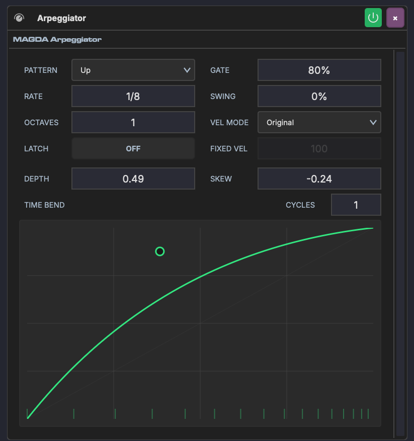

# Arpeggiator

The Arpeggiator is a MIDI device that takes held chords and plays them back as a rhythmic pattern — one note at a time, in a chosen order and rate.

## Overview

The Arpeggiator sits on a track's device chain before an instrument. It intercepts incoming MIDI chords and outputs arpeggiated note sequences. Hold a chord on your keyboard and the arpeggiator cycles through its notes at the configured rate and pattern.

## Parameters

### Pattern & Timing

| Parameter | Range | Description |
|-----------|-------|-------------|
| **Pattern** | Up, Down, Up/Down, Down/Up, Random, As Played | Note order within each cycle |
| **Rate** | Musical subdivisions (1/1 – 1/32, triplets, dotted) | Speed of the arpeggio steps |
| **Octaves** | 1–4 | How many octaves the pattern spans before repeating |
| **Gate** | 0–100% | Note length as a percentage of the step duration. Lower values produce staccato; higher values produce legato. |
| **Swing** | -100% to 100% | Offsets every other step for a shuffle feel |
| **Latch** | On / Off | When on, the arpeggio continues playing after you release the keys |

### Velocity

| Parameter | Range | Description |
|-----------|-------|-------------|
| **Vel Mode** | Original, Fixed, Accent | How output velocity is determined. Original uses the played velocity; Fixed uses a set value; Accent alternates between normal and accent levels. |
| **Fixed Vel** | 0–127 | Velocity value used when Vel Mode is set to Fixed |

### Time Bend

The [Time Bend](../time-bend.md) section reshapes the timing of arpeggiated notes within each cycle. Instead of evenly spaced steps, notes can accelerate, decelerate, or cluster in rhythmic patterns.

| Parameter | Range | Description |
|-----------|-------|-------------|
| **Depth** | -1.0 to 1.0 | Curve intensity — positive front-loads notes, negative back-loads them |
| **Skew** | -1.0 to 1.0 | Shifts the curve's inflection point earlier or later |
| **Cycles** | 1–8 | Repeats the curve within each arpeggio cycle |

The interactive curve display shows the timing transformation in real time. During playback, a green sweep animation tracks the current step position. Drag the handle to shape the curve, or double-click to reset.

Depth, Skew, and Cycles can be linked to [Macros](../modulation/macros.md) for automatable timing modulation — morph from straight to swung patterns in real time.

## Usage

1. Place the Arpeggiator before an instrument on a track's device chain
2. Play or input a chord — the arpeggiator breaks it into individual notes
3. Adjust Pattern, Rate, and Gate to shape the basic rhythm
4. Use Time Bend to add rhythmic variation beyond simple swing
5. Enable Latch to keep the arpeggio running while you change chords
