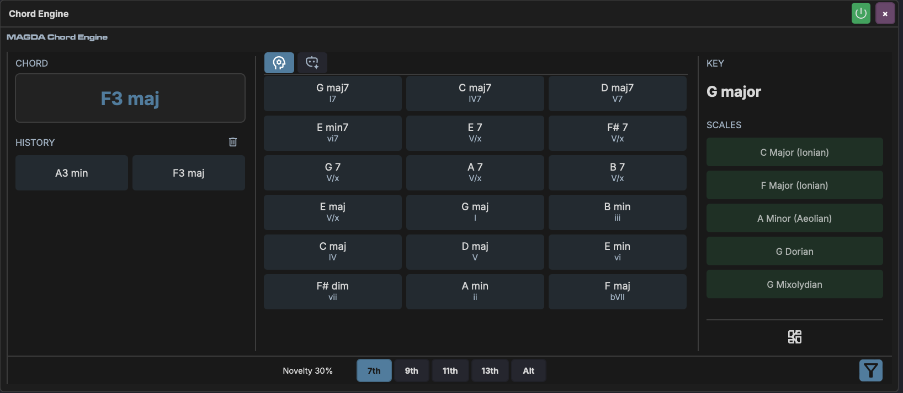
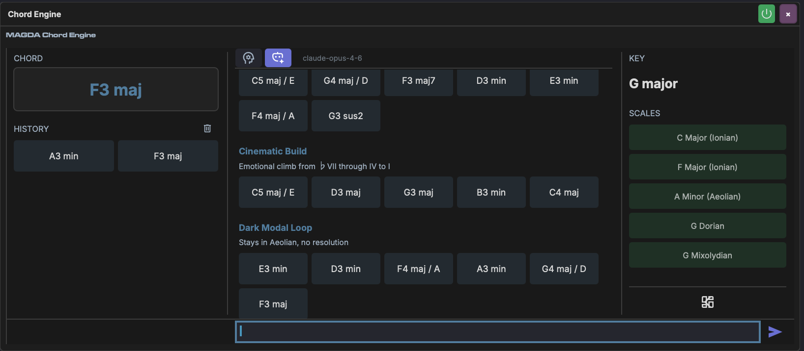
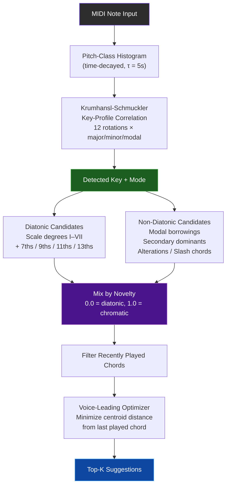
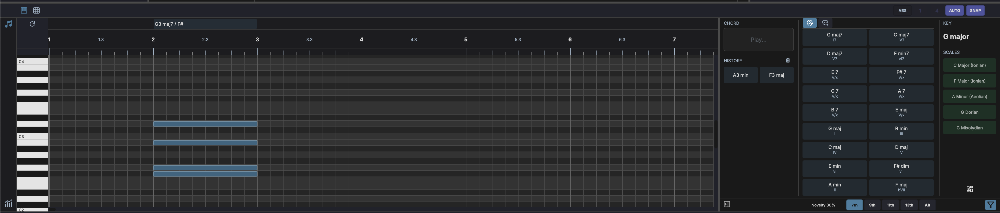

# Chord Engine

The Chord Engine is MAGDA's built-in chord analysis, suggestion, and generation device. It detects chords from incoming MIDI, identifies the musical key, and suggests what chord to play next — all in real time.

## Overview

The Chord Engine is a MIDI device that lives on an instrument track's FX chain. Unlike a typical plugin panel, its interface is also embedded directly in the Piano Roll — chord suggestions appear alongside your notes, and you can drag chords straight onto the timeline. This tight integration between harmonic analysis and note editing is central to the workflow.

It analyses incoming MIDI notes and provides:

- **Real-time chord detection** — identifies the chord you're playing
- **Key and scale detection** — determines the tonal centre from your playing
- **Context-aware chord suggestions** — recommends chords based on music theory and voice leading
- **AI-generated progressions** — uses a language model to compose chord progressions in a given style
- **Drag-and-drop to Piano Roll** — drop suggestions directly onto the timeline as MIDI notes with chord annotations

The device has two tabs: **K&S** (Krumhansl-Schmuckler analysis and suggestions) and **AI** (LLM-generated progressions).

## K&S Tab

The K&S tab uses the Krumhansl-Schmuckler algorithm to detect the key from your playing and generate chord suggestions from music theory rules. The interface has three columns:

| Column | Content |
|--------|---------|
| **Chord** (left) | Currently detected chord, recent history, and a **Play** button for auditioning |
| **Suggestions** (centre) | Grid of chord suggestions with Roman numeral degrees |
| **Key / Scale** (right) | Detected key, matching scales, and scale browser |

### Chord Detection

Play notes on the track and the panel displays the detected chord name in real time. Detection uses pitch-class set matching against a library of known chord shapes (triads, sevenths, ninths, elevenths, thirteenths, augmented, diminished, suspended, and slash voicings).

Recent chords appear in the **History** section.

### Key Detection

The detected key (e.g. "D# minor") is shown at the top of the right column. It uses the **Krumhansl-Schmuckler key-finding algorithm**:

1. A **pitch-class histogram** accumulates every note you play, weighted by an exponential time decay (recent notes matter more; decay constant is 5 seconds).
2. The histogram is correlated against **Krumhansl major and minor profiles** — empirically derived distributions of pitch-class frequency in tonal music.
3. All 24 possible keys (12 roots x major/minor) are scored. A small bias toward the third of each candidate helps disambiguate major vs minor.
4. The highest-scoring key wins.

### Scale Detection

Below the key, the panel lists the top matching scales (Ionian, Aeolian, Dorian, Mixolydian, Pentatonic, etc.), ranked by how well your pitch content matches each scale's note set.

- **Click** a scale to see all diatonic chords built from it
- **Shift-click** a scale to select it for filtering (highlights green). Multiple scales can be selected — their pitch classes are merged to filter suggestions

### Suggestion Generation

Suggestions are generated from:

- **Diatonic candidates** — chords built from scale degrees I–VII, with optional extensions (7ths, 9ths, 11ths, 13ths)
- **Non-diatonic candidates** — modal borrowings, secondary dominants, and altered chords
- **Voice leading** — suggestions are voiced to minimise movement from the last chord played

Recently played chords are filtered out so suggestions always point forward.

### Footer Controls

| Control | Description |
|---------|-------------|
| **Nov** (Novelty) | Balance between diatonic (0%) and chromatic (100%) suggestions |
| **7th** | Toggle seventh chord suggestions |
| **9th** | Toggle ninth chord suggestions |
| **11th** | Toggle eleventh chord suggestions |
| **13th** | Toggle thirteenth chord suggestions |
| **Alt** | Toggle altered/non-diatonic chord suggestions |

## AI Tab

In AI mode, a language model generates full chord progressions based on a text description. Type a prompt describing the style, mood, or harmonic flavour you want, and the AI returns a sequence of chords.

### Using AI Suggestions

1. Type a description in the text field. This can be a qualitative mood description (e.g. "soulful and jazzy", "dark ambient") or a functional one using chord grades (e.g. "I-iv-V7 progression", "ii-V-I turnaround")
2. Press **Enter** or click the send button
3. The AI returns one or more labelled progressions as rows of chord buttons
4. **Click** a chord to audition it
5. **Drag** a chord onto the Piano Roll to place it as MIDI notes

AI progressions are labelled with a short description (e.g. "Dim pull with warm iv and V7", "Backdoor cadence into Dim").

### AI with Key Context

The AI receives the currently detected key as context, so its suggestions are harmonically relevant to what you've been playing.

## Suggestion Pipeline

The K&S tab's suggestion engine uses the following pipeline:

## Chord Timeline

When a Chord Engine is present on a track, the Piano Roll automatically shows a **chord row** above the note grid. This row displays chord annotations that are linked to their MIDI notes.

### Placing Chords

Drag a chord from the suggestions grid and drop it onto the Piano Roll:

1. **Drop** sets the start position — a blinking indicator appears
2. **Move the mouse** to preview the chord length
3. **Click** to confirm the length, or press **Enter** to use the default length
4. Press **Escape** to cancel

The dropped chord creates both MIDI notes and a chord annotation in the timeline. These are linked — moving, resizing, or deleting the notes automatically updates the annotation.

### Detecting Chords

Click the refresh button in the chord row to auto-detect chords from existing notes. The detection scans notes at each bar boundary, identifies chords with 2+ simultaneous notes, and creates linked annotations.

### Note Tracking

Chord annotations track their associated MIDI notes in real time:

- **Move notes** — the annotation follows
- **Resize notes** — the annotation length updates
- **Delete notes** — the annotation shrinks or disappears
- **Transpose notes** — the chord name re-detects automatically
- **Undo/redo** — annotations revert along with their notes
