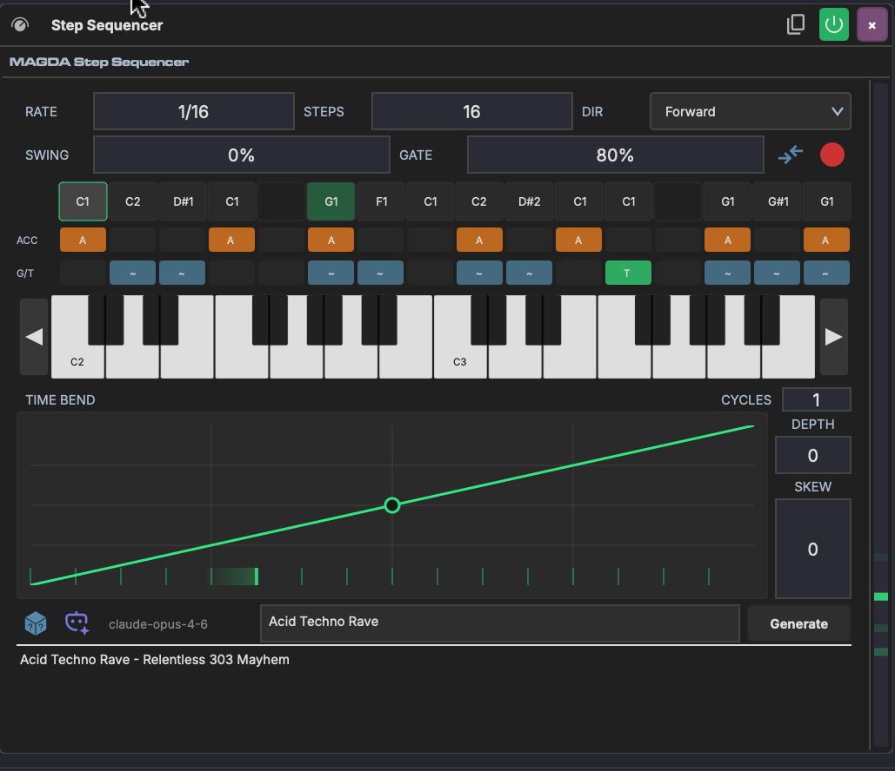

# Step Sequencer

The Step Sequencer is a MIDI device that generates melodic and rhythmic patterns from a grid of programmable steps. Each step has a pitch, velocity, gate length, and optional glide — giving you precise control over every note in the sequence.

## Overview

The Step Sequencer sits on a track's device chain before an instrument. It plays through a pattern of steps in sync with the project tempo, independent of any MIDI input. Steps can be programmed by clicking the grid, playing notes via step recording, or generating patterns with AI.

## Parameters

### Timing & Direction

| Parameter | Range | Description |
|-----------|-------|-------------|
| **Rate** | Musical subdivisions (1/1 – 1/32, triplets, dotted) | How fast the sequencer advances through steps |
| **Steps** | 1–16 | Number of active steps in the pattern |
| **Dir** | Forward, Reverse, Ping-Pong, Random | Playback direction through the step grid |
| **Swing** | -100% to 100% | Offsets every other step for a shuffle feel |
| **Gate** | 0–100% | Default note length as a percentage of the step duration |

### Velocity

| Parameter | Description |
|-----------|-------------|
| **Accent Vel** | Velocity for accented steps |
| **Normal Vel** | Velocity for non-accented steps |

Individual step velocities can also be set directly on each step in the grid.

### Time Bend

The [Time Bend](../time-bend.md) section reshapes step timing within each cycle, the same way it works in the [Arpeggiator](arpeggiator.md). Steps that would normally fire on a rigid grid get redistributed according to the curve — compressing some and expanding others.

| Parameter | Range | Description |
|-----------|-------|-------------|
| **Depth** | -1.0 to 1.0 | Curve intensity — positive front-loads steps, negative back-loads them |
| **Skew** | -1.0 to 1.0 | Shifts the curve's inflection point earlier or later |
| **Cycles** | 1–8 | Repeats the curve within each pattern cycle |

Depth and Skew can be linked to [Macros](../modulation/macros.md) for real-time timing modulation.

## The Step Grid

The main area of the Step Sequencer is a keyboard-style grid. Rows represent pitches (with a piano keyboard on the right) and columns represent steps. Click a cell to place a note on that step.

Each step can have:

- **Pitch** — set by which row you click
- **Velocity** — adjustable per step
- **Accent** — toggleable per step for emphasis
- **Glide** — smooth pitch transition from the previous step

## Step Recording

Click the step record button to enter step recording mode. Play a note on your MIDI controller and it will be placed on the current step, then the cursor advances to the next step. This is a fast way to input melodies without clicking the grid.

## MIDI Thru

The MIDI thru button passes incoming MIDI notes through to the downstream instrument alongside the sequencer output. This lets you play live over the sequence.

## AI Pattern Generation

The Step Sequencer can generate patterns using AI:

1. Type a description in the prompt field (e.g. "acid techno bassline")
2. Click **Generate**
3. The AI fills the step grid with a matching pattern

You can also click the random button for a quick random pattern.

## Known Limitations

- **Arrangement loop boundary**: The Step Sequencer may produce a brief timing glitch when the arrangement transport loops back to the start. This does not affect session clips or non-looping playback.
