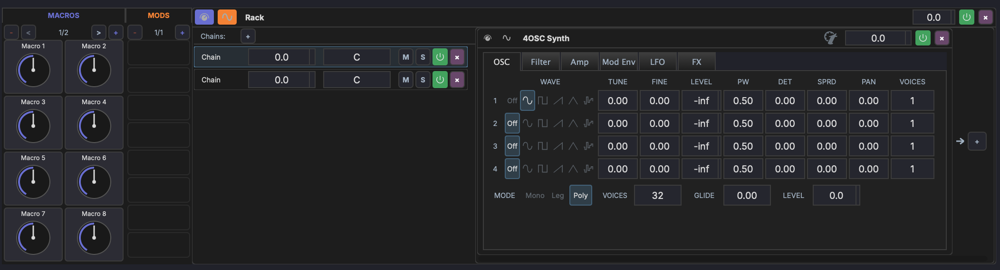

# FX Chain & Racks

Each track has an **FX chain** — an ordered list of audio processors applied to the track's signal.

## Overview

The FX chain is displayed in the bottom panel when a track or device is selected. Signal flows left to right through the chain.

!!! note
    The chain header provides access to the **track tree** { width="16" }, a hierarchical view of all devices and racks on the track. You can also click the **rack** button { width="16" } to create a new rack in the chain.

The chain can contain:

- **Plugins** — VST3, AU, or VST effect and instrument plugins
- **Built-in devices** — MAGDA's own processors (see [Built-in Devices](devices/built-in.md))
- **Racks** — Container devices with nested chains and parallel routing

## Working with Devices

- **Drag** plugins from the [Plugin Browser](panels/browsers.md) onto the chain to add them
- **Drag** devices to reorder them in the chain
- **Click** a device to select it and show its parameters
- **Right-click** a device for options: bypass, remove, replace, move to rack
- Each device has **Mod** and **Macro** buttons to toggle the modulation and macro panels

## Racks

A rack is a container that holds one or more **parallel chains**. Signal flows into the rack, splits across chains, and mixes back together at the output.

### Creating a Rack

- Click the { width="16" } **rack** button in the chain header
- Right-click a device and select **Move to Rack** to wrap it in a new rack

### Chains

Each rack contains one or more chains displayed as rows. Each chain has:

- **Volume** — Level control for the chain's output
- **Pan** — Stereo positioning of the chain
- **Mute** (M) / **Solo** (S) — Mute or solo individual chains
- **Devices** — Each chain has its own ordered list of devices

Click the **+** button next to "Chains" to add a new parallel chain.

### Use Cases

- **Parallel processing** — Blend dry and wet signals (e.g., parallel compression)
- **Multi-band processing** — Split signal into frequency bands with different processing
- **Organized grouping** — Keep related devices together in a collapsible container

### Rack Controls

- **Volume** — Master output level for the entire rack
- **Mod / Macro buttons** — Access the rack's own modulation and macro panels
- **Collapse/Expand** — Click the rack header to toggle between collapsed and expanded views
