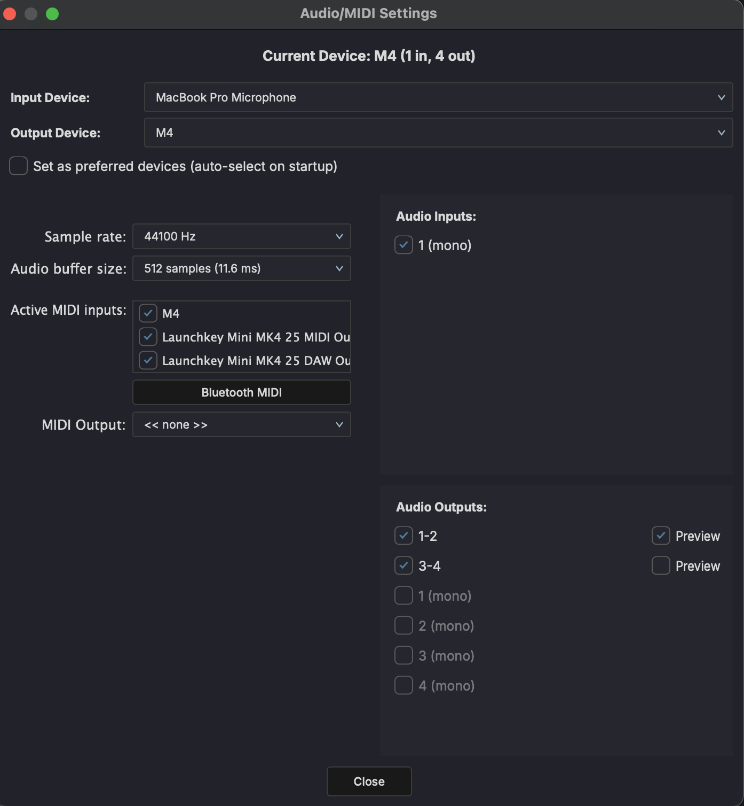

# Audio Settings

Open audio settings from **Settings > Audio Settings**.

## Audio Device

- **Output device** — Select your audio interface or built-in output
- **Input device** — Select the audio input for recording
- **Sample rate** — 44100 Hz and 48000 Hz are common choices
- **Buffer size** — Lower values reduce latency but increase CPU load

!!! tip
    MAGDA automatically optimizes buffer sizes when switching views: Live mode uses the lowest latency, while Mix and Arrange modes use larger buffers for stability.

## Channel Configuration

- **Active output channels** — Choose which output channels to use (stereo pair or multi-channel)
- **Active input channels** — Choose which input channels are available for recording

## MIDI

- **MIDI input devices** — Enable or disable connected MIDI controllers and keyboards
- **MIDI output devices** — Enable or disable MIDI output to hardware synthesizers

## Preferred Device

- **Use as preferred device** — Check this box to remember your device selection and restore it automatically on startup. If the preferred device is unavailable, MAGDA falls back to the system default.
