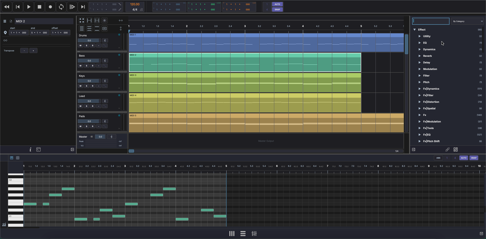
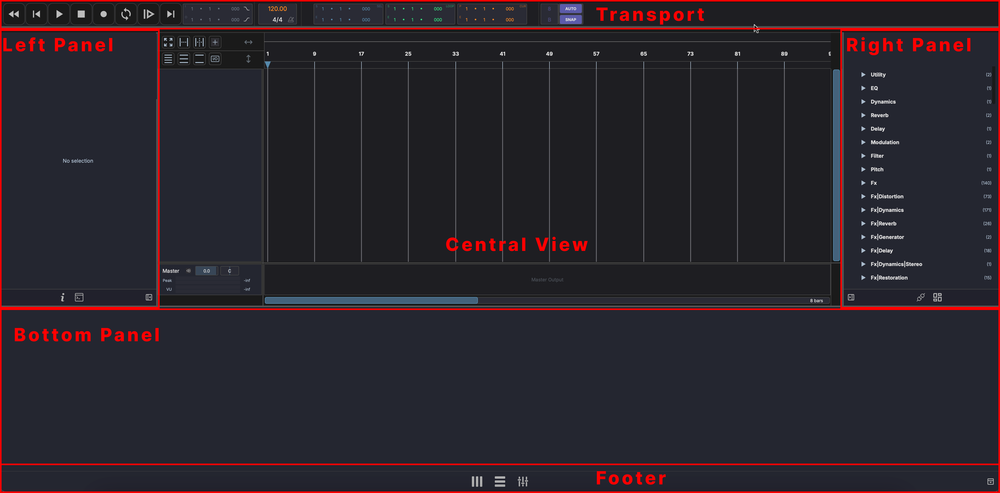

# Interface Overview

MAGDA's window is divided into fixed regions that stay consistent across all three views (Live, Arrange, Mix).

## Window Layout

## Transport Bar

The transport bar sits at the top of the window and is always visible. It provides playback controls, tempo, time signature, loop/punch settings, and position displays. See [Transport](../transport.md) for details.

## Left Panel

The left panel contains:

- **Inspector** — Context-sensitive properties for the selected track, clip, note, or device. See [Inspector](../panels/inspector.md).
- **AI Assistant** — Chat-based assistant for natural-language control. See [AI Assistant](../panels/ai-assistant.md).

## Central View

The central area displays one of three views depending on the active mode:

- { width="18" } **Session View** — Grid-based clip launcher for real-time performance. See [Session View](../session-view.md).
- { width="18" } **Arrangement View** — Traditional timeline for composing and editing. See [Arrangement View](../arrangement-view.md).
- { width="18" } **Mixer View** — Channel-strip mixer for balancing and routing. See [Mixer View](../mixer-view.md).

Switch between views using the mode buttons in the footer.

## Right Panel

The right panel contains two tools:

- **Plugin Browser** — Browse, search, and drag plugins onto tracks
- **Media Explorer** — Browse the file system, preview audio files, and drag them into the project

See [Plugin & Media Browser](../panels/browsers.md) for details.

## Bottom Panel

The bottom panel auto-switches based on the current selection:

- **Empty** — Nothing selected
- **Piano Roll** — When a MIDI clip is selected
- **Drum Grid** — When a drum clip or DrumGrid device is selected
- **Waveform Editor** — When an audio clip is selected
- **Track Chain** — When a track or device is selected, showing the FX chain

See [Editors](../panels/editors.md) for details.

## Footer

The footer bar at the bottom of the window contains:

- **Live** / **Arrange** / **Mix** mode buttons — Switch between the three main views
- Panel visibility toggles

## Panel Behavior

All side and bottom panels are:

- **Collapsible** — Click the panel header or use keyboard shortcuts to show/hide
- **Resizable** — Drag the panel edges to adjust width or height
