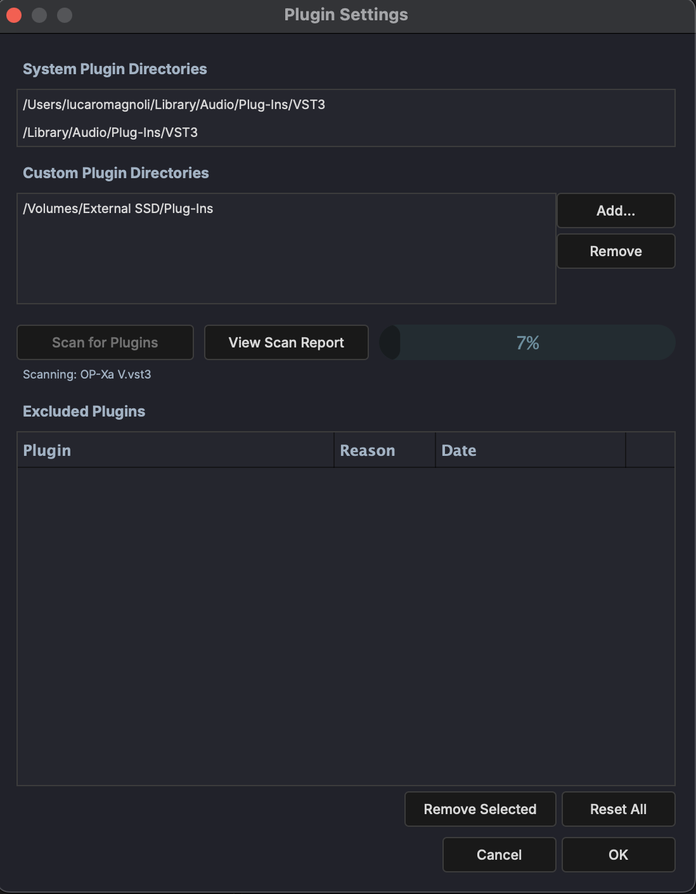

# Plugin Settings

The Plugin Settings dialog manages VST3 plugin directories, scanning, and exclusions. Open it from **Settings > Plugin Scan**.

## System Plugin Directories

Lists the default system paths where MAGDA looks for VST3 plugins. These are read-only and determined by the operating system:

- `/Users/<name>/Library/Audio/Plug-Ins/VST3` (user)
- `/Library/Audio/Plug-Ins/VST3` (system)

## Custom Plugin Directories

Add extra folders for MAGDA to search when scanning for plugins. Use the **Add...** button to browse for a directory and **Remove** to delete the selected entry.

## Scanning

- **Scan for Plugins** — Start a full scan of all listed directories. A progress bar shows scan progress.
- **View Scan Report** — Open the log from the most recent scan, showing which plugins were found, loaded, or rejected.

## Excluded Plugins

Plugins that failed to load or were manually excluded appear here with the reason and date. Use **Remove Selected** to re-enable individual plugins or **Reset All** to clear the entire exclusion list.
