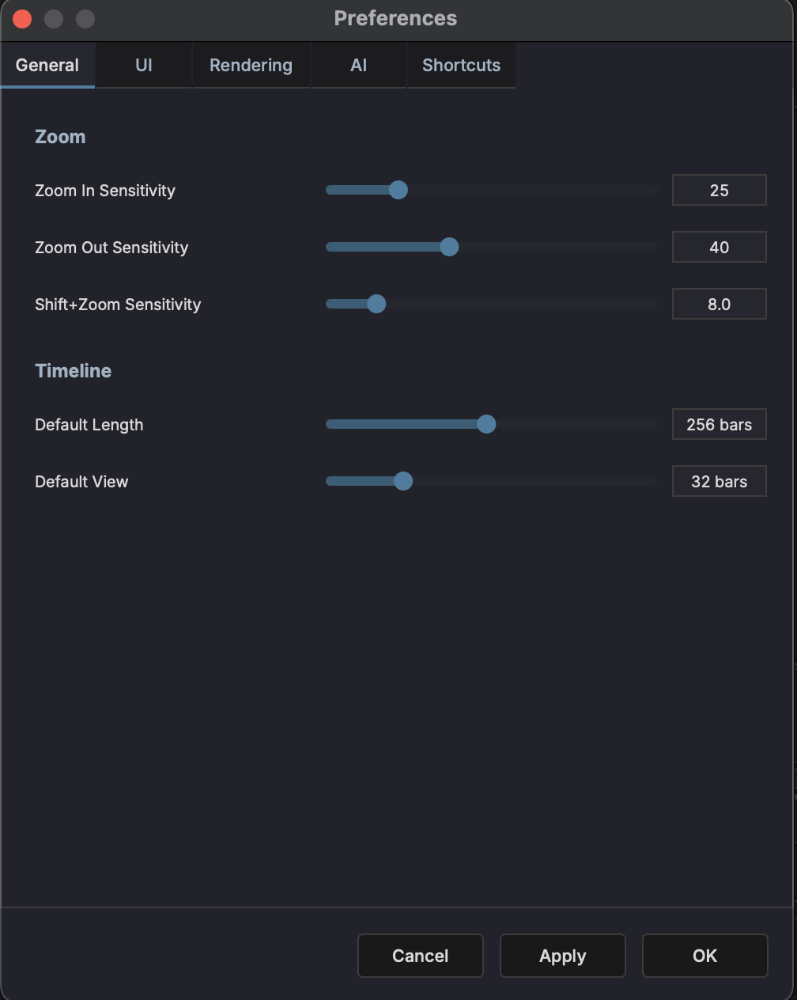

# Preferences

Open the Preferences dialog from **Settings > Preferences**. The dialog has five tabs.

## General

- **Default zoom level** — Initial horizontal zoom when opening a project
- **Timeline units** — Choose between bars/beats and time (minutes:seconds)

## UI

- **Panel visibility defaults** — Choose which panels are shown on startup
- **Behavior settings** — Configure UI interaction preferences

## Rendering

- **Default format** — Choose the default audio format for renders (WAV, AIFF, FLAC, OGG)
- **Sample rate** — Default sample rate for rendered files
- **Bit depth** — Default bit depth for rendered files

## AI

- **API key** — Enter your API key to enable the AI Assistant

See [AI Assistant](../panels/ai-assistant.md) for more on setting up and using the AI chat.

## Shortcuts

- **Keyboard shortcuts** — View and customize all keyboard shortcuts
- **Reset to defaults** — Restore the default shortcut mappings

See [Keyboard Shortcuts](../reference/keyboard-shortcuts.md) for the full default shortcut list.
