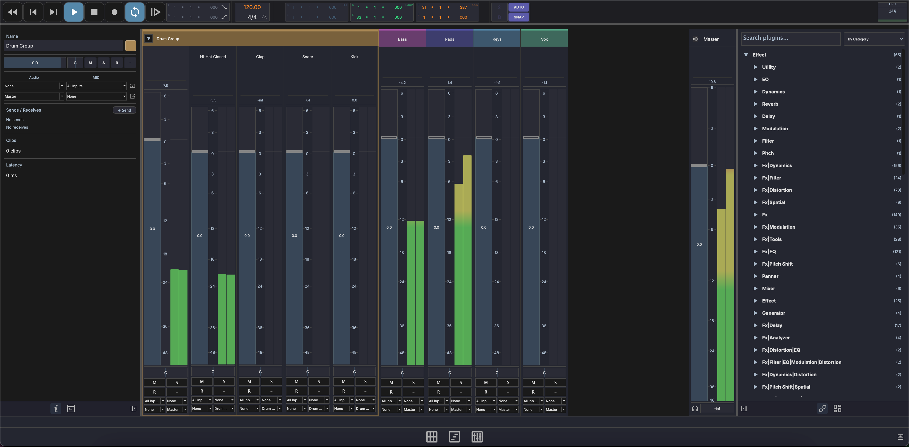

# Mixer View

The Mixer View provides a channel-strip interface for balancing levels, panning, routing, and applying effects. Switch to it by clicking **Mix** in the footer bar.



## Layout

```
┌──────────┬──────────┬──────────┬──────────┬─────────┐
│ Track 1  │ Track 2  │ Track 3  │ Aux 1    │ Master  │
│          │          │          │          │         │
│ [Routing]│ [Routing]│ [Routing]│ [Routing]│         │
│ [Sends]  │ [Sends]  │ [Sends]  │ [Sends]  │         │
│          │          │          │          │         │
│  ┃  ┃    │  ┃  ┃    │  ┃  ┃    │  ┃  ┃    │  ┃  ┃   │
│  ┃██┃    │  ┃█ ┃    │  ┃  ┃    │  ┃█ ┃    │  ┃██┃   │
│  ┃██┃    │  ┃██┃    │  ┃█ ┃    │  ┃██┃    │  ┃██┃   │
│  ┃██┃    │  ┃██┃    │  ┃██┃    │  ┃██┃    │  ┃██┃   │
│  [Pan]   │  [Pan]   │  [Pan]   │  [Pan]   │  [Pan]  │
│  M S R   │  M S R   │  M S R   │  M S     │         │
│ Track 1  │ Track 2  │ Track 3  │ Aux 1    │ Master  │
└──────────┴──────────┴──────────┴──────────┴─────────┘
```

- **Channel strips** — One per track, scrollable horizontally
- **Aux channel strips** — Auxiliary/bus tracks
- **Master channel strip** — Final output, fixed on the right
- **Resizable width** — Drag the edge of a channel strip to resize

Click a channel strip to select it. Drag plugins onto a channel strip to add them to the track's FX chain.

## Channel Strip Controls

Each channel strip provides:

### Volume Fader

Drag the fader to adjust the track's output level. The dB scale is displayed alongside the fader.

### Level Meters

Stereo level meters (L/R) show the real-time signal level. A peak label displays the highest level reached — watch for clipping.

### Pan

The pan control positions the track in the stereo field, from hard left to hard right.

### Mute, Solo, Record

- **Mute** (M) — Silence the track output
- **Solo** (S) — Solo this track, muting all others
- **Record** (R) — Arm the track for recording
- **Monitor** — Enable input monitoring

### Track Name and Color

The track name and color bar are displayed at the bottom of each strip for identification.

## Master Channel Strip

The master strip controls the final output level of the mix. It has its own volume fader, meters, and pan control but no mute/solo/record buttons.

## I/O Routing

Each channel strip has routing selectors for:

- **Audio input** — Select which physical input or bus feeds the track
- **Audio output** — Choose where the track's audio is sent (master, aux bus, etc.)
- **MIDI input** — Select the MIDI input device and channel
- **MIDI output** — Route MIDI to a specific device or virtual instrument

## Sends

Each channel strip has a send section for routing audio to auxiliary buses.

- **Add a send** — Create a new send slot to route signal to an aux track
- **Send level** — Adjust how much signal is sent to the aux bus
- **Remove a send** — Click the remove button on a send slot to delete it

The send section is resizable — drag the resize handle to show more or fewer send slots.

## Multi-Output Plugins

When an instrument has multiple output pairs activated, each output appears as its own channel strip in the mixer — just like any other track. You can route these strips to groups or aux sends independently. See [Multi-Output Plugins](tracks.md#multi-output-plugins) for setup details.

## DrumGrid Sub-Channels

When a track contains a DrumGrid device with multiple outputs, the mixer can expand to show individual sub-channel strips for each drum voice, giving you independent level and pan control per pad output. See [Drum Grid](devices/drum-grid.md) for details.
