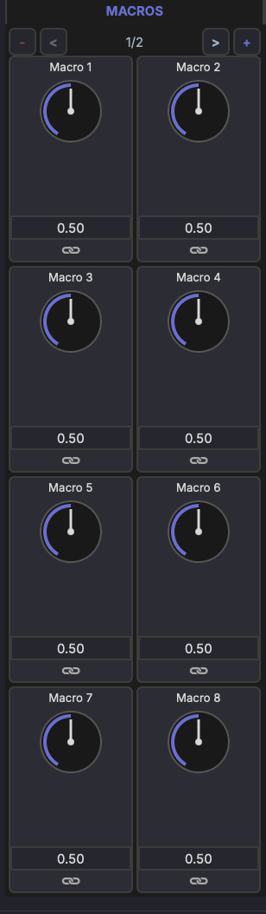

# Macros

Macros are user-defined control knobs that provide quick, unified access to multiple device parameters.

## Layout

Each track has **16 macro knobs** organized across **2 pages** (8 knobs per page). Macros are visible in the track's device chain and in the Inspector when the track is selected.

## Range

All macro knobs output a normalized **0–1 range**. The mapping to each target parameter's actual range is handled by the modulation link (see [Linking Parameters](linking.md)).

## Naming

- Click a macro label to rename it (e.g., "Filter Cutoff", "Drive Amount")
- Names are displayed on the knob and in the modulation matrix

## Assigning Parameters

To connect a macro to a parameter:

1. Enter link mode (see [Linking Parameters](linking.md))
2. Select the macro as the modulation source
3. Click the target parameter
4. Adjust the modulation amount and polarity

A single macro can control multiple parameters simultaneously — for example, one "Brightness" knob could increase filter cutoff, reduce reverb wet, and boost high-shelf EQ gain at the same time.

## Use Cases

- Map the most important synth parameters to a few knobs for live performance
- Create unified controls that coordinate multiple effects at once
- Expose simple controls for complex multi-device setups
