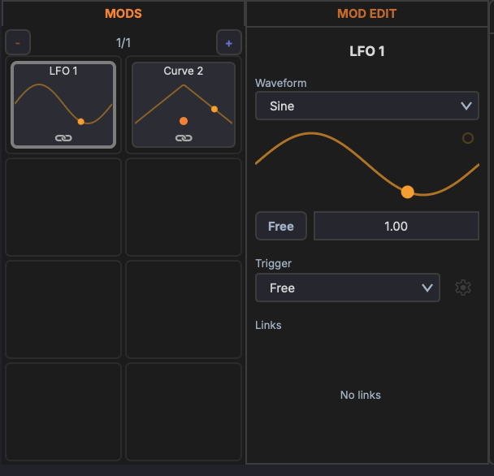

# Modulators

Modulators are signal generators that modulate device parameters over time. Each device and rack can have its own set of modulators.

## LFO

A low-frequency oscillator that cycles through a waveform shape.

### Waveforms

- Sine
- Triangle
- Sawtooth
- Square
- Random (Sample & Hold)

### Parameters

- **Rate** — Speed of the LFO cycle (Hz or synced to tempo)
- **Depth** — Modulation amount
- **Phase offset** — Starting point in the waveform cycle (0°–360°)
- **Tempo sync** — Lock the rate to musical divisions (1/4, 1/8, 1/16, etc.)
- **One-shot** — Play the waveform once instead of looping

## Bezier Curve Shape

A freely editable modulation shape drawn with bezier curves. Use this to create complex, custom modulation patterns that go beyond standard waveforms.

### Editing

- **Add a point** — Double-click on the curve
- **Move a point** — Drag it to a new position
- **Adjust curvature** — Drag the bezier handles to shape the curve between points
- **Delete a point** — Double-click an existing point

### Parameters

- **Rate** — Speed of the curve cycle (Hz or synced to tempo)
- **Depth** — Modulation amount
- **Tempo sync** — Lock the rate to musical divisions
