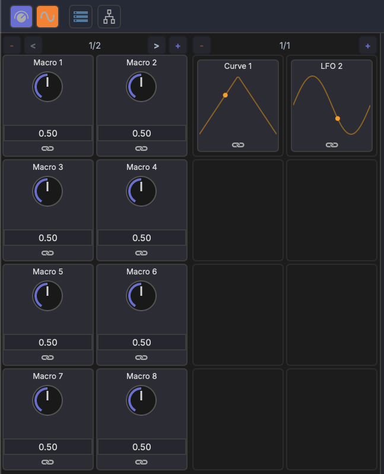

# Modulation Overview

MAGDA provides two complementary modulation systems: **Modulators** and **Macros**. Both allow you to dynamically control device parameters without manual automation.

## Modulators

Modulators are signal generators that continuously vary a target parameter over time. MAGDA includes:

- **LFO** — Low-frequency oscillator with multiple waveforms (sine, triangle, sawtooth, square, random)
- **Bezier Curve Shape** — Freely editable modulation shape drawn with bezier curves for complex custom patterns

See [Modulators](modulators.md) for details.

## Macros

Macros are user-defined knobs that can control multiple parameters at once. Each track has 16 macro knobs (across 2 pages) that provide quick access to the most important parameters.

See [Macros](macros.md) for details.

## Hierarchical Scope

Modulators and macros are scoped to their parent track. A modulator on Track 1 can target any parameter within Track 1's device chain, but not parameters on other tracks.

## Multi-Target and Multi-Source

- A single modulator can drive **multiple target parameters** simultaneously
- A single parameter can be driven by **multiple modulation sources**, with their effects combined

## Global Modulator & Macro Panel

{ width="400" }

Each track's modulators and macros are managed from the modulation panel in the bottom section. The panel shows macro knobs on the left and active modulators (LFO, Curve) on the right, with page navigation for both.

## Internal Device Modulation

Some built-in devices have their own internal modulation routing that operates inside the device's audio processing. For example, the [4OSC Synth](../devices/4osc.md) has two LFOs and two modulation envelopes that can be routed to any of its parameters via an internal mod matrix.

Internal modulation and track-level modulation are independent and can be used together.

## Linking

Parameters are connected to modulation sources using MAGDA's link mode. See [Linking Parameters](linking.md) for the workflow.
