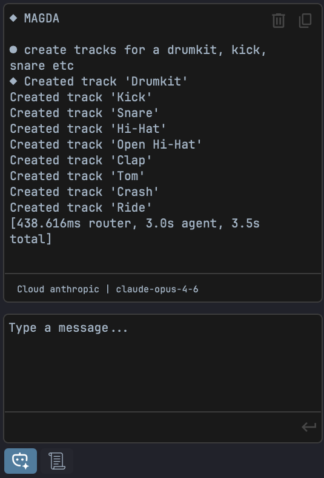

# AI Assistant

MAGDA includes a built-in AI chat assistant that lets you control the DAW using natural language.

{ width="400" }

## Overview

The AI Assistant panel is located in the left panel. Type a request in natural language and the assistant translates it into actions:

- "Add a MIDI track with a bass clip"
- "Transpose the selected notes up an octave"
- "Set the tempo to 120 BPM"
- "Mute tracks 3 and 4"

The assistant is **context-aware** — it knows which tracks, clips, and devices exist in your project and what is currently selected.

## How It Works

1. You type a natural-language request in the chat
2. The assistant translates your request into MAGDA's internal DSL (domain-specific language)
3. The DSL commands are executed as actions in the project
4. The assistant confirms what was done

## Setup

The AI Assistant uses the OpenAI API. You'll need an API key to get started.

1. Go to **Settings > Preferences > AI**
2. Enter your OpenAI API key

If you don't have an API key, you can generate one at [platform.openai.com/api-keys](https://platform.openai.com/api-keys).

## Usage Tips

- Be specific: "Add a reverb to Track 2" works better than "make it sound spacey"
- The assistant can handle multi-step requests: "Create 4 MIDI tracks and name them Kick, Snare, HiHat, Bass"
- Use it for repetitive tasks: "Set all tracks to -6 dB"

## MAGDA DSL Reference

The AI assistant translates natural language into MAGDA's domain-specific language (DSL). While you don't need to write DSL directly, understanding it can help you phrase better requests.

### Tracks

```
track(name="Bass", type="midi")           // Create a new track
track(id=1)                               // Reference existing track by index
track(name="Bass").track.set(volume_db=-3, pan=0.5, mute=true, solo=true)
track(name="Bass").select()               // Select track in UI
track(name="Bass").delete()               // Delete track
```

### Clips

```
track(name="Bass").clip.new(bar=1, length_bars=4)     // Create MIDI clip
track(name="Bass").clip.rename(index=0, name="Intro") // Rename clip
track(name="Bass").clip.delete(index=0)                // Delete clip
```

### Notes

```
.notes.add(pitch=C4, beat=0, length=1, velocity=100)
.notes.delete()
.notes.transpose(semitones=5)
.notes.set_pitch(pitch=F1)
.notes.set_velocity(value=80)
.notes.quantize(grid=0.25)       // 0.25=16th, 0.5=8th, 1.0=quarter
.notes.resize(length=0.5)
```

### Chords

```
.notes.add_chord(root=C4, quality=major, beat=0, length=1, velocity=100, inversion=0)
```

Supported qualities: `major`, `minor`, `dim`, `aug`, `sus2`, `sus4`, `dom7`, `maj7`, `min7`, `dim7`, `dom9`, `maj9`, `min9`, `dom11`, `min11`, `dom13`, `min13`, `add9`, `add11`, `add13`, `6`, `min6`, `7b5`, `7sharp5`, `7b9`, `7sharp9`, `min7b5`, `power`

### Arpeggios

```
.notes.add_arpeggio(root=C4, quality=minor, beat=0, step=0.5,
                    note_length=0.5, velocity=100, pattern=up, fill=true)
```

Patterns: `up`, `down`, `updown`. Set `fill=true` to repeat the pattern to fill the entire clip, or `beats=N` to fill a specific number of beats.

### Effects

```
track(name="Vocals").fx.add(name="reverb")
track(name="Vocals").fx.add(name="Pro-Q 3", format="VST3")
```

Built-in effects: `eq`, `compressor`, `reverb`, `delay`, `chorus`, `phaser`, `filter`, `utility`, `pitch shift`, `ir reverb`

### Selection and Filtering

```
// Select notes by condition
.notes.select(note.pitch == C4)
.notes.select(note.velocity > 100)

// Select clips by condition
.clips.select(clip.length_bars >= 2)

// Bulk operations on matching tracks
filter(tracks, track.name == "Drums").track.set(mute=true)
filter(tracks, track.name == "Drums").for_each(.fx.add(name="compressor"))
```

### Example: Full Workflow

```
// Create a synth track with a 4-bar chord progression
track(name="Synth", type="midi")
  .clip.new(bar=1, length_bars=4)
  .notes.add_chord(root=C4, quality=major, beat=0, length=4)
  .notes.add_chord(root=F4, quality=major, beat=4, length=4)
  .notes.add_chord(root=G4, quality=major, beat=8, length=4)
  .notes.add_chord(root=Am3, quality=minor, beat=12, length=4)

// Add an arpeggiated lead
track(name="Lead", type="midi")
  .clip.new(bar=1, length_bars=4)
  .notes.add_arpeggio(root=C4, quality=major, step=0.25, pattern=updown, fill=true)

// Add reverb and set volume
track(name="Lead").fx.add(name="reverb").track.set(volume_db=-6)
```
