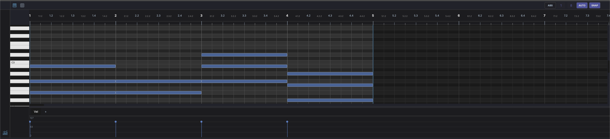
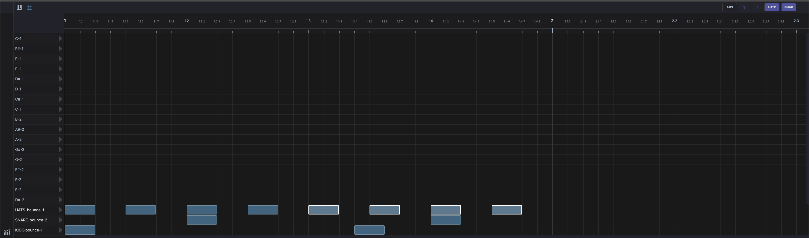
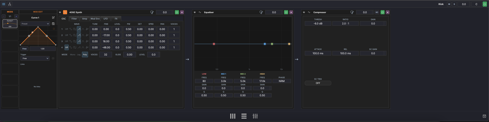

# Editors

The bottom panel displays an editor that auto-switches based on the current selection.

## Piano Roll

Displayed when a MIDI clip is selected. Provides a grid for editing notes:

- **Horizontal axis** — Time (bars and beats)
- **Vertical axis** — Pitch (MIDI note numbers, with piano keyboard on the left)
- **Click** to add a note
- **Drag** a note to move it in time or pitch
- **Drag edges** to resize note length
- **Velocity lane** at the bottom for editing note velocities

!!! note "Header controls"
    - **Grid resolution** — Draggable numerator/denominator for grid subdivision
    - **AUTO** — Automatically adjust grid resolution based on zoom level
    - **SNAP** — Toggle snap-to-grid

!!! note "Footer controls"
    - { width="16" } **Velocity** — Toggle the velocity/MIDI lane at the bottom of the editor

## Drum Grid Editor

Displayed when a drum clip is selected or a DrumGrid device is active. Shows a step-sequencer-style grid:

- **Rows** represent drum pads / MIDI notes
- **Columns** represent time steps
- **Click** cells to toggle hits on/off
- **Velocity** per hit is adjustable

!!! note "Header controls"
    - **Grid resolution** — Draggable numerator/denominator for grid subdivision
    - **AUTO** — Automatically adjust grid resolution based on zoom level
    - **SNAP** — Toggle snap-to-grid

!!! note "Footer controls"
    - { width="16" } **Velocity** — Toggle the velocity lane at the bottom of the editor

See [Drum Grid](../devices/drum-grid.md) for details on the DrumGrid device.

## Waveform Editor

Displayed when an audio clip is selected. Shows the audio waveform with:

- **Zoom and scroll** within the clip
- **Fade handles** at clip edges for fade-in/fade-out
- **Warp markers** for time-stretching (when warp is enabled)
- **Selection** for cutting, copying, or rendering portions

!!! note "Header controls"
    - **ABS / REL** — Toggle between absolute (timeline) and relative (clip) time mode
    - **Grid resolution** — Draggable numerator/denominator for grid subdivision
    - **SNAP** — Toggle snap-to-grid
    - **GRID** — Toggle grid line visibility

## Track Chain

Displayed when a track or device is selected. Shows the track's FX chain as a horizontal strip of devices:

- **Drag** devices to reorder them in the chain
- **Click** a device to select it and show its parameters in the Inspector
- **Drag** plugins from the Plugin Browser onto the chain to add them
- **Right-click** a device for options: bypass, remove, replace, move to rack
- **Racks** are shown as expandable containers with nested parallel chains

!!! note "Header controls"
    - { width="16" } **Rack** — Create a new rack on the track
    - { width="16" } **Tree** — Open the track tree, a hierarchical view of all devices and racks
    - **Track name**, **M** (mute), **S** (solo), **volume**, **pan** — Quick access to track controls
    - { width="16" } **Bypass** — Bypass the entire track chain
