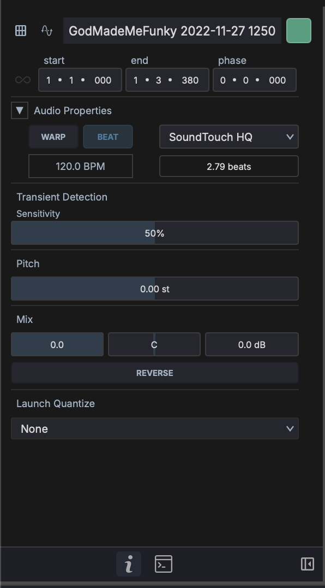

# Inspector

The Inspector panel is on the right side of the window. It displays context-sensitive properties for the currently selected item.

## Track Inspector

Displayed when a track is selected. Shows:

- **Track name** — Click to rename
- **Track color** — Click the color swatch to choose a custom color, or leave as auto-assigned
- **Volume and pan** — Numeric readouts and controls
- **Input routing** — Select audio/MIDI input source
- **Output routing** — Select audio/MIDI output destination
- **Sends** — List of send slots with level controls

## Clip Inspector

Displayed when a clip is selected. Shows:

- **Clip name** — Click to rename
- **Clip color** — Click the color swatch to choose a custom color
- **Position** — Start time, end time, and phase offset on the timeline
- **Loop settings** — Loop on/off, loop start, loop length

### Audio Properties

For audio clips, the inspector shows additional controls:

- **Warp / Beat** — Toggle time-stretch mode; select algorithm (e.g. SoundTouch HQ)
- **Tempo** — Source BPM and beat length detection
- **Transient Detection** — Sensitivity slider for transient markers
- **Pitch** — Transpose in semitones
- **Mix** — Volume, pan, and gain controls
- **Reverse** — Reverse the clip audio
- **Launch Quantize** — Quantize setting for Session View clip launching

## Note Inspector

Displayed when one or more MIDI notes are selected in the Piano Roll. Shows:

- **Pitch** — MIDI note number and name
- **Velocity** — Note velocity (0–127)
- **Start** — Note start position
- **Length** — Note duration

When multiple notes are selected, the inspector shows ranges (e.g., "C3–G5") and allows batch editing.

## Device Inspector

Displayed when a device (plugin or built-in) is selected in the track chain. Shows:

- **Device name** — Click to rename the instance
- **Device type** — Plugin format and category
- **Parameters** — All exposed parameters with knobs/sliders
