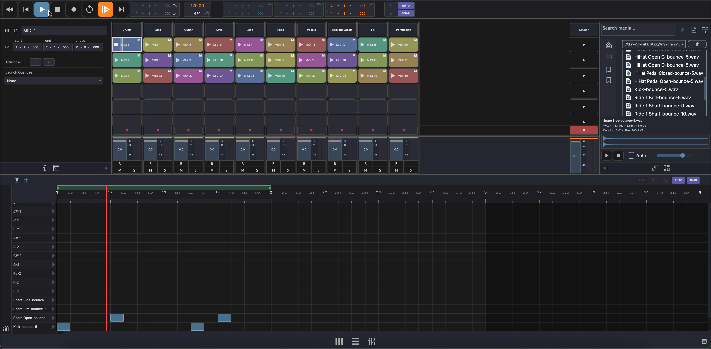

# Session View

The Session View is a grid-based clip launcher for real-time performance and idea sketching. Switch to it by clicking **Live** in the footer bar.



## Layout

The Session View is organized as a grid:

- **Columns** represent tracks
- **Rows** represent scenes
- Each cell is a **clip slot** that can hold an audio or MIDI clip

```
 Track 1    Track 2    Track 3   │ Scene
┌──────────┬──────────┬──────────┼────────┐
│ Clip A   │          │ Clip D   │ ► 1    │
├──────────┼──────────┼──────────┼────────┤
│          │ Clip B   │ Clip E   │ ► 2    │
├──────────┼──────────┼──────────┼────────┤
│ Clip C   │          │          │ ► 3    │
├──────────┼──────────┼──────────┼────────┤
│ Fader    │ Fader    │ Fader    │ ■ Stop │
└──────────┴──────────┴──────────┴────────┘
```

- **Track headers** run across the top — click to select a track
- **Scene launch buttons** on the right trigger all clips in a row simultaneously
- **Stop All** button (■) stops all playing clips
- **Mini mixer** fader row at the bottom provides quick mixing controls

## Clip Slots

Each cell in the grid is a clip slot. A slot can be empty or contain a clip.

- **Click** an occupied slot to trigger (play) the clip
- **Click** a playing slot to stop it
- Only one clip per track plays at a time — triggering a new clip in the same column stops the previous one

## Scenes

A scene is a horizontal row across all tracks. Launching a scene triggers all clips in that row simultaneously, which is useful for transitioning between song sections during a live performance.

- Click the **scene launch button** (►) on the right side to launch a scene
- Use the **Stop All** button (■) to stop all playing clips at once

## Mini Mixer

At the bottom of the Session View, each track has a mini channel strip for quick mixing without leaving the clip launcher.

Each mini channel strip provides:

- **Volume fader** — Adjust track level
- **Pan knob** — Position in the stereo field
- **Mute** (M) — Silence the track
- **Solo** (S) — Listen to only this track

A **master strip** is also available for the main output level.

The fader row is resizable — drag the top edge to make it taller or shorter.

### I/O and Send Rows

Optional rows for I/O routing and send levels can be toggled on or off to keep the view compact or show more detail.

## Drag and Drop

- Drag audio files from the Media Explorer onto a clip slot to import them
- Drag plugins onto a track header to add effects

## Adding Clips

- Drag and drop audio or MIDI files from the [Media Explorer](panels/browsers.md) onto an empty clip slot
- Record into the arrangement and move clips to the session grid

!!! note
    Clip launching quantize and follow-action settings are configured in the [Clip Inspector](panels/inspector.md).
