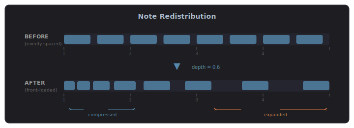
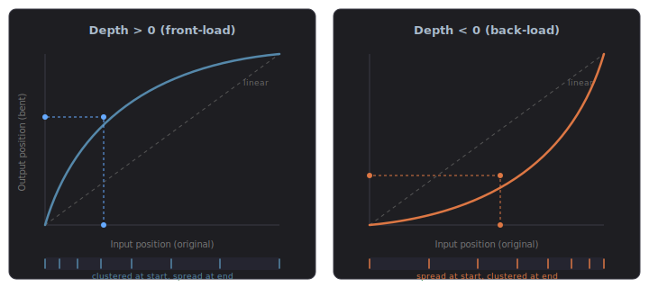
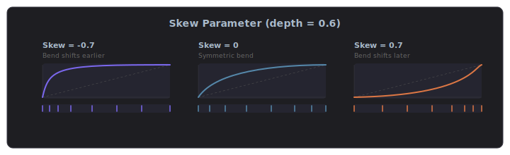
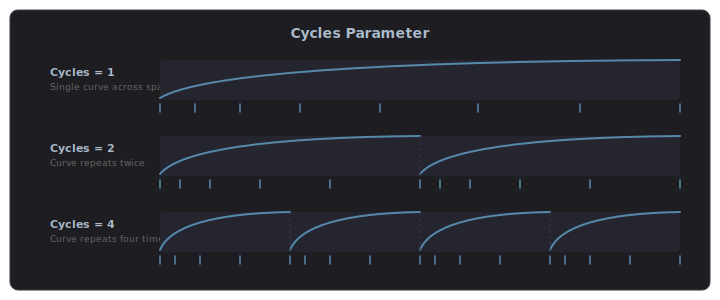
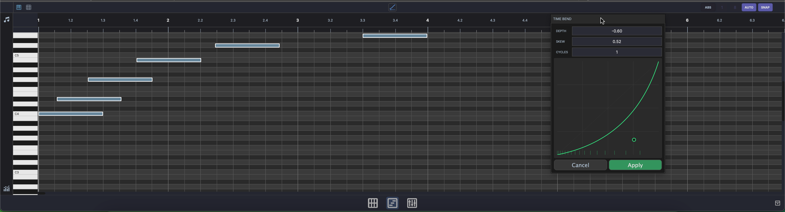

# Time Bend

Time Bend is a timing tool that redistributes notes or steps according to a curve. Instead of notes being evenly spaced, they cluster toward the beginning or end of a phrase, creating swing-like, accelerating, or decelerating rhythmic effects. Time Bend is available across MAGDA in four contexts: the [Piano Roll](#piano-roll), the [Drum Grid Editor](#drum-grid-editor), the [Arpeggiator](#arpeggiator), and the [Step Sequencer](#step-sequencer).

## How It Works

Time Bend maps each note's position within a time span through a curve. Notes that fall on the steep part of the curve move further apart; notes on the flat part bunch together. The overall span stays the same — only the distribution within it changes.

### Parameters

| Parameter | Range | Description |
|-----------|-------|-------------|
| **Depth** | -1.0 to 1.0 | Controls the curve intensity. Positive values front-load notes (they cluster toward the start). Negative values back-load notes (they cluster toward the end). Zero means no effect. |
| **Skew** | -1.0 to 1.0 | Shifts the curve's inflection point left or right. At zero the curve is symmetric. Negative skew moves the bend earlier; positive skew moves it later. |
| **Cycles** | 1–8 | Repeats the curve across the time span. At 1 the curve applies once across all notes. Higher values divide the span into equal segments, each shaped by the curve independently. |

### Depth

The depth parameter controls how aggressively notes are compressed or expanded. Positive depth pushes notes toward the start of the span (front-loading), while negative depth pushes them toward the end (back-loading). The curve shows the mapping: where it's steep, notes spread apart; where it's flat, they bunch together.

### Skew

The skew parameter shifts where the bend happens within the span. At zero, the bend is symmetric. Negative skew moves the inflection point earlier (sharp bend at the start, gentle tail). Positive skew moves it later (gentle start, sharp bend at the end).

### Cycles

The cycles parameter repeats the curve across the time span. At 1, a single curve shapes all notes. At higher values, the span is divided into equal segments, each independently shaped by the same curve. This creates repeating rhythmic patterns within a single phrase.

### The Curve Display

The interactive curve display shows a visual representation of the timing transformation:

- The **diagonal line** represents linear (unmodified) timing
- The **curve** shows the actual timing mapping — how input positions map to output positions
- The **tick marks** at the bottom show the resulting note distribution
- **Drag the handle** to adjust depth and skew simultaneously
- **Double-click** to reset to linear (no effect)

During playback (in the Arpeggiator and Step Sequencer), a green sweep animation shows the current playback position moving across the ticks.

## Piano Roll

Select two or more notes in the [Piano Roll](panels/editors.md#piano-roll) and click the Time Bend button in the editor header bar. A popup appears with the curve display and Depth, Skew, and Cycles sliders.

As you adjust the curve, the selected notes move in real time as a preview. Click **Apply** to confirm — this creates an undoable action, so you can ++ctrl+z++ to revert. Click **Cancel** or close the popup to restore the original positions.

!!! note "Minimum selection"
    Time Bend requires at least two selected notes. The button appears inactive (grey) when fewer than two notes are selected.

## Drum Grid Editor

Time Bend works identically in the [Drum Grid Editor](panels/editors.md#drum-grid-editor). Select notes, click the Time Bend button, shape the curve, and apply.

## Arpeggiator

The [Arpeggiator](devices/arpeggiator.md) has Time Bend built into its device panel. The **Depth**, **Skew**, and **Cycles** sliders sit alongside the curve display in the TIME BEND section.

In the Arpeggiator, Time Bend affects the timing of arpeggiated notes in real time during playback. The curve reshapes when each step fires within the arpeggio cycle — notes still play in the same order, but the rhythm changes. Depth, Skew, and Cycles can be linked to [Macros](modulation/macros.md) for dynamic, automatable timing modulation.

## Step Sequencer

The [Step Sequencer](devices/step-sequencer.md) also has Time Bend built into its device panel, working the same way as in the Arpeggiator. The curve redistributes step trigger times within each cycle, turning rigid grid patterns into flowing, organic rhythms.

## Tips

- **Subtle humanization** — A small positive depth (around 0.1–0.2) with one cycle gently pushes notes ahead of the beat, similar to a drummer who plays slightly ahead.
- **Accelerando / ritardando** — Use a single cycle with moderate depth to make a phrase speed up or slow down.
- **Polyrhythmic patterns** — Set cycles to 3 or 5 over a 4-beat span to create cross-rhythmic groupings.
- **Combine with groove** — Time Bend stacks with groove templates. Apply groove first for feel, then Time Bend for phrase-level shaping.
