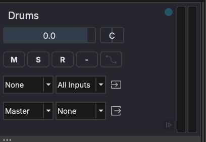

# Tracks

Tracks are the fundamental building blocks in MAGDA. They appear in all three views — as columns in Session View, rows in Arrangement View, and channel strips in Mixer View.

## Hybrid Track System

MAGDA uses a **hybrid track system**: there is no strict distinction between audio and MIDI tracks. Any track can contain any combination of audio clips, MIDI clips, and other clip types. The track's behavior adapts based on the clips and devices it contains.

## Track Types

| Type | Description |
|------|-------------|
| **Audio** | Standard track for audio recording and playback |
| **Instrument** | Track with a virtual instrument plugin loaded |
| **MIDI** | Track that sends MIDI to external devices |
| **Group** | Bus track that groups multiple child tracks |
| **Aux** | Auxiliary/send-return track for shared effects |
| **Master** | Final stereo output — one per project |

## Track Controls

Every track provides the following controls (visible in track headers and channel strips):

- **Volume fader** — Adjust the track's output level
- **Pan knob** — Position in the stereo field
- **Mute** (M) — Silence the track. Shortcut: select the track and press ++m++
- **Solo** (S) — Solo the track. Shortcut: select the track and press ++shift+s++
- **Record arm** (R) — Arm the track for recording
- **Input monitor** — Monitor the live input signal through the track
- **Automation** — Toggle automation read/write for the track

## Adding and Managing Tracks

- Press ++ctrl+t++ (++cmd+t++ on macOS) to add a new track
- Right-click a track header for options: rename, color, duplicate, delete, freeze
- Click the track name to rename it

## FX Chain

Each track has an FX chain — an ordered list of audio processors applied to the track's signal. See [FX Chain & Racks](fx-chain.md) for full details.

## Clips

Tracks contain clips — audio and MIDI data blocks arranged on the timeline. See [Clips](clips.md) for details on editing, splitting, duplicating, and rendering clips.
