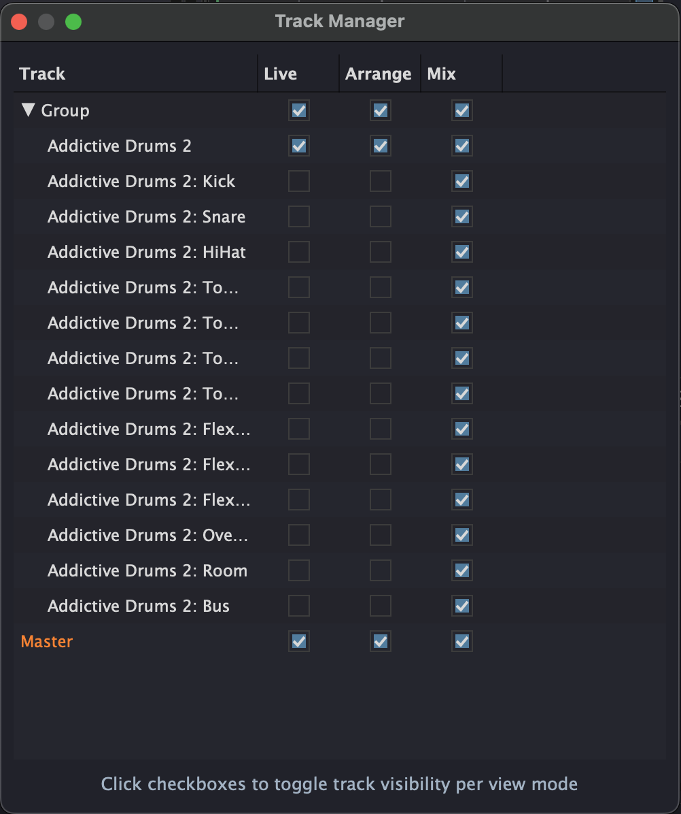
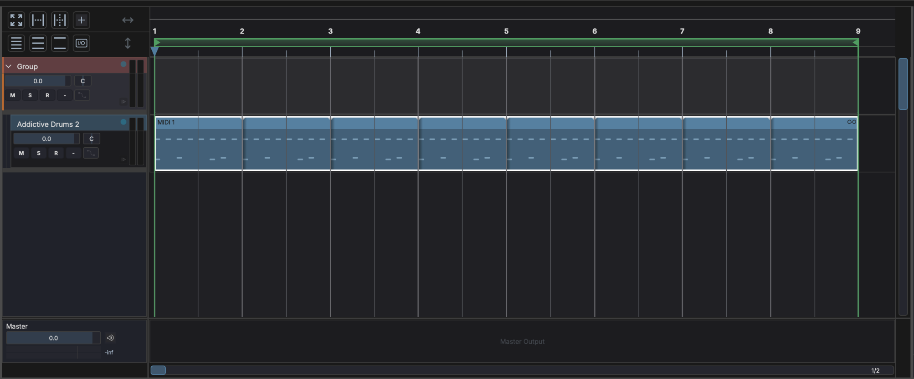
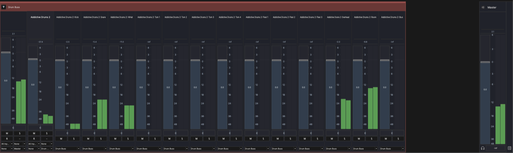

# Tracks

Tracks are the fundamental building blocks in MAGDA. They appear in all three views — as columns in Session View, rows in Arrangement View, and channel strips in Mixer View.

## Hybrid Track System

MAGDA uses a **hybrid track system**: there is no strict distinction between audio and MIDI tracks. Any track can contain any combination of audio clips, MIDI clips, and other clip types. The track's behavior adapts based on the clips and devices it contains.

## Track Types

| Type | Description |
|------|-------------|
| **Audio** | Standard track for audio recording and playback |
| **Instrument** | Track with a virtual instrument plugin loaded |
| **MIDI** | Track that sends MIDI to external devices |
| **Group** | Bus track that groups multiple child tracks |
| **Aux** | Auxiliary/send-return track for shared effects |
| **Master** | Final stereo output — one per project |

## Track Controls

Every track provides the following controls (visible in track headers and channel strips):

- **Volume fader** — Adjust the track's output level
- **Pan knob** — Position in the stereo field
- **Mute** (M) — Silence the track. Shortcut: select the track and press ++m++
- **Solo** (S) — Solo the track. Shortcut: select the track and press ++shift+s++
- **Record arm** (R) — Arm the track for recording
- **Input monitor** — Monitor the live input signal through the track
- **Automation** — Toggle automation read/write for the track

## Multi-Output Plugins

When an instrument plugin has more than two output channels (e.g. Kontakt, Battery, Drum Machine Designer), MAGDA can create separate output tracks for each stereo pair.

- Open the multi-out menu on the device (the { width="16" } button) and activate the output pairs you need
- Each activated pair creates an **independent track** placed directly after the instrument track
- Output tracks behave like any other track — you can rename, reorder, route to groups, and apply FX
- To organize them, select the output tracks and move them into a [Group](#track-types) using the right-click menu

!!! note
    Multi-out tracks receive audio from the parent instrument's rack — their input routing is fixed. Output routing (to master, groups, or aux sends) works normally.

## Track View Manager

Each of the three views — Session, Arrangement, and Mixer — maintains its own independent track visibility and layout. This means you can show a different set of tracks in each view.

{ width="300" }

Open the Track Manager from the **View** menu to configure track visibility per view. Each column (Live, Arrange, Mix) has independent checkboxes — toggle them to control which tracks appear in each view.

Per-view track settings include:

- **Visible** — Whether the track appears in this view
- **Locked** — Prevent editing the track in this view
- **Collapsed** — For group tracks: collapse or expand children
- **Height** — Track row height (Arrangement View)

### Example: Multi-Output Workflow

A common use case is keeping the Arrangement View clean while having full control in the Mixer. With a multi-output instrument like Addictive Drums, you can hide the individual output tracks from the Arrangement and show only the MIDI track you compose on:

**Arrangement View** — Only the group and the instrument's MIDI track are visible, keeping the timeline uncluttered:

**Mixer View** — All output tracks are visible for independent level, pan, and effects control per drum voice:

## Adding and Managing Tracks

- Press ++ctrl+t++ (++cmd+t++ on macOS) to add a new track
- Right-click a track header for options: rename, duplicate, delete, freeze
- Click the track name to rename it

## FX Chain

Each track has an FX chain — an ordered list of audio processors applied to the track's signal. See [FX Chain & Racks](fx-chain.md) for full details.

## Clips

Tracks contain clips — audio and MIDI data blocks arranged on the timeline. See [Clips](clips.md) for details on editing, splitting, duplicating, and rendering clips.
