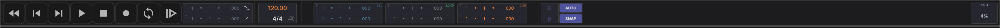

# Transport

The transport bar sits at the top of the window and is available in all views.

## Navigation & Playback

From left to right, the transport buttons are:

| Button | Action | Shortcut |
|--------|--------|----------|
| **Home** | Return to the beginning | ++home++ |
| **Previous** | Jump to previous marker | |
| **Next** | Jump to next marker | |
| **Play** | Start/stop playback | ++space++ |
| **Stop** | Stop and reset | ++space++ |
| **Record** | Start/stop recording | ++r++ |
| **Loop** | Toggle loop playback | |
| **Back to Arrangement** | Return from session clip playback to the arrangement position | |

## Loop

Enable looping with the **Loop** button in the transport. The loop region is defined by start and end points, displayed as editable time labels (bars:beats:ticks).

- **Set loop from a time selection** — Make a time selection in the arrangement and press ++l++ to set the loop region to match the selection
- **Set loop from a clip** — Select the clip and press ++ctrl+shift+l++ (++cmd+shift+l++)

## Punch In/Out

Use punch in and punch out to record only within a specific time range. Enable punch mode and set the punch region start and end points in the transport bar.

## Position Displays

The transport shows editable displays for:

- **Playhead position** — Current playback time
- **Edit cursor position** — Position of the edit cursor
- **Time selection** — Start and end of the current selection

## Tempo

The tempo (BPM) is displayed in the transport bar. You can change it by:

- Clicking and dragging the tempo value up or down
- Clicking the tempo label and typing a new value

## Time Signature

The time signature is displayed alongside the tempo in the transport bar.

## Grid & Snap

The grid controls how clips and edits snap to musical divisions.

- **Snap toggle** — Enable or disable snapping to the grid
- **Grid quantize** — Set the grid resolution (e.g., 1/4, 1/8, 1/16 notes) using the numerator and denominator controls
- **Auto-grid** — Automatically adjust the grid resolution based on the current zoom level
